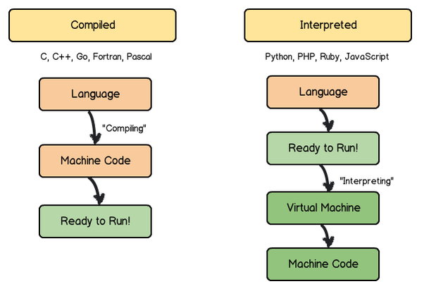

# # JavaScript Library Babel

## 簡介

**Babel is a JavaScript compiler toolchain that is mainly used to convert ECMAScript 2015+ code into a backwards compatible version of JavaScript in current and older browsers or environments.**

自 1998 年起的第一次[瀏覽器戰爭 ( Browser War )](https://zh.wikipedia.org/zh-tw/%E6%B5%8F%E8%A7%88%E5%99%A8%E5%A4%A7%E6%88%98)以 Internet Explorer 稱霸當時瀏覽器主要市場後的 10 年間，為了追求更好的使用者互動，在此期間 Flash 的 ActionScript 崛起並主宰了這段時間，而跟隨 HTML4 規範的 HTML、JavaScript、CSS 則被市場封存在過往。

直到第二次戰爭開始前，原本退出市場的 Netscape 擁抱開源，並在此期間延伸出 Firefox、Chromium，此時為了更佳的使用者互動而更隨 Internet Explorer 設計的外部軟體 Flash 卻為應對第二次瀏覽器戰爭導致系統的逐漸肥大，為了更好應對此次爭霸的瀏覽器戰國時代，默默推進的腳本語言 ECMAScript 伴隨著 [HTML5](https://zh.wikipedia.org/zh-tw/HTML5) 制定再次回到了世人的目光中。

跟隨 HTML5 規範，使用的 ECMAScript 2015，也稱為 ES6，添加了諸多語法與規範，相較過往 ES3 更加嚴謹且符合[程式語言泛型 ( Programming paradigm )](https://zh.wikipedia.org/zh-tw/%E7%BC%96%E7%A8%8B%E8%8C%83%E5%9E%8B)，然而，此時正值瀏覽器戰國，諸家爭鳴的時期，為了讓新制定的 ECMAScript 規範能相容於舊制瀏覽器，並應對不同時期的瀏覽器支援。



本是直譯腳本的 JavaScript 便在開發流程中增加編譯流程，使其能有效導入各類程式語言泛型 ( Programming paradigm )，讓 JavaScript 從過往的腳本逐漸成熟成如今廣泛運用的語言；而肩負著 JavaScript 編譯的主要工具，便是本專案討論的 Babel。

Babel 就如其文獻所說，是 JavaScript 編譯器工具，主要用途可分為以下幾項：

+ 句法轉換
+ 補充目標環境缺失的功能特徵
+ 原始碼轉換

由於以上功能，Babel 也可用於將特定框架 ( Framework ) 的語法轉換，已讓其可用於不同的瀏覽器；但需注意，並非所有瀏覽器都支援 ESMASCript 各版本，這也意味不同框架與工具底層可使用的 ECMAScript 版本需依據產品預期對應的瀏覽器進行選擇，避免產品若入系統破碎化的陷阱。

以 Node.js 基礎使用 V8 引擎為範例，若要確認 Node.js 可適用的 ECMASCript 範圍，可參考 [node.green](https://node.green/) 的列表。

## 範例

本專案執行的範例：

+ 使用 Node.js 18+ LTS 版本
+ 應對不同 Babel 版本

## 執行

本專案使用的命令介面僅適用 Windows 環境且運行於 Docker 環境。

+ 進入 Babel 6 開發環境
```
babel dev --ver=6
```
> 操作說明參考[內文](./src/6/readme.md)

+ 進入 Babel 7 開發環境
```
babel dev --ver=7
```
> 操作說明參考[內文](./src/7/readme.md)

## 導覽

### [使用 Babel](https://babeljs.io/docs/en/usage)

Babel 是自 ECMAScript 2015 ( ES6 ) 開始使用，但由於 ES6 演進到 ES7 間有諸多功能更新且應用於諸如 React 等框架，因此在 ES7 進行了改版，連帶使用的套件也更換了名稱；若觀察 ES6 相關套件在 NPM 上的說明，也有諸多描述此套件並不適用的部分，因此，若非特殊用途，還是應推進版本至 ES7 的範疇。

#### 安裝

Balel 可以透過 npm 的套件管理工具來安裝至專案中，其主要相關套件可以在 npm 中查詢 [@babel](https://www.npmjs.com/search?q=%40babel) 來搜尋。

```
npm install --save-dev @babel/core @babel/cli @babel/preset-env @babel/polyfill
```

而構成 Babel 工具主要有四個部分：

+ [core](https://babeljs.io/docs/en/babel-core)：babel 的核心程式
+ [cli](https://babeljs.io/docs/en/babel-cli)：babel 提供的命令介面工具
+ [preset-env](https://babeljs.io/docs/en/babel-preset-env)：套件參數集
+ [polyfill](https://babeljs.io/docs/en/babel-polyfill)：修正指令集

#### 命令介面工具

Babel 可透過安裝命令介面工具 ( CLI ) 讓 package.json 內的 ```script``` 可以使用，或利用此工具來檢視轉換的狀況，若要在 node.js 環境中執行運用 babel 的程式，則需安裝 [babel-node](https://babeljs.io/docs/en/babel-node) 來確保此命令工具可使用。

在範例中，則是使用 ```bable-node``` 來確保 node 執行程式時會使用 babel 進行語法轉換

```
npx babel-node main.js
```

#### Plugins & Presets

**Transformations come in the form of plugins, which are small JavaScript programs that instruct Babel on how to carry out transformations to the code.**

如前述所提，bable 自 2015 後有諸多功能更新，更有依據階段推出，而要更新這些語法功能，則可以利用 Plugin 來補充，因此這些 Plugin 即是諸多語法轉換的微小程式集。

**Instead of adding all the plugins we want one by one, we can use a "preset" which is just a pre-determined set of plugins.**

正因為 Plugin 的推出是階段的，並考慮如 React 框架各自推出的語法轉換，若要逐一添加要使用的 Plugin 會容易遺失內容，因此使用 Presets 來一次定義可以使用的 Plugins。

嚴格來說，Presets 套件的更新最好更隨 Core，避免版本落差導致功能未被導入。

#### Polyfill

**As of Babel 7.4.0, this package has been deprecated in favor of directly including core-js/stable (to polyfill ECMAScript features)**

依據文獻所述，在 babel 7.4.0 後，```@babel/ployfill``` 套件將被移除 ( 或無需額外安裝 )，Polyfill 主要是透過此模塊來確保瀏覽器執行環境可正常執行 ES6 後版本的語法；會需要這功能，主要是考量瀏覽器對 ESMAScript 的支援度問題，若該瀏覽器未實作部分命令物件，會導致編譯後的 JavaScript 無法正常運作於瀏覽器。

而對應於不同的瀏覽器，應透過設定 Babel 的方式來添加如下資訊，以確保執行瀏覽器的最低限度的修復套件會被編譯引入。

```
{
  "presets": [
    [
      "@babel/preset-env",
      {
        "targets": {
          "edge": "17",
          "firefox": "60",
          "chrome": "67",
          "safari": "11.1"
        },
        "useBuiltIns": "usage"
      }
    ]
  ]
}
```

### [設定 Babel](https://babeljs.io/docs/en/configuration)

依據文獻所述，Babel 設定共有三個方式：

+ 設定於 ```babel.config.json```，亦可透過 ```babel.config.js``` 動態產生設定檔
+ 設定於 ```.babelrc```，格式為 JSON，在文獻中提到基於相容設定，```.bablerc``` 是 ```.bablerc.json``` 的別名
+ 設定於 ```package.json``` 的 ```babel``` 集合
```
{
  "name": "my-package",
  "version": "1.0.0",
  "babel": {
    "presets": [ ... ],
    "plugins": [ ... ],
  }
}
```

在程式語言中的諸多編譯工具都有動態設定的可能性，此動態設定往往基於編譯產出的版本、功能有關，因此會利用第一種方式修改設定檔，但這設定方式容易讓設定檔難以解讀，因此，除非需要並不建議使用此方式；同理，若僅是簡單的固定設定則可利用第三方式讓設定簡化於單一檔案內。

## 文獻

+ [Babel](https://babeljs.io/docs/en/)
    - [Babel.js - wiki](https://zh.wikipedia.org/zh-tw/Babel_(%E7%B7%A8%E8%AD%AF%E5%99%A8))
    - [ECMAScript](https://zh.wikipedia.org/zh-tw/ECMAScript)
+ [Node.js](https://nodejs.org/en/)
    - [Node.js - wiki](https://zh.wikipedia.org/zh-tw/Node.js)
    - [npm.js](https://docs.npmjs.com/cli/v7/commands)
+ [ECMAScript 6 feature](https://github.com/lukehoban/es6features)
    - [【JS102】升級你的 JavaScript 技能：ES6 + npm + Jest 筆記](https://medium.com/@eilin0603/68fe66b1df96)
